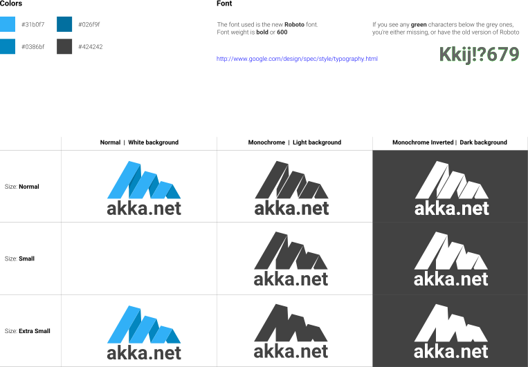

Font: **Roboto** [Download](http://www.google.com/design/spec/style/typography.html)

Weight: **Bold/600**

| **Colors** | |
| --: | :-- |
|  | `#31b0f7` |
|  | `#0386bf` |
|  | `#026f9f` |
|  | `#424242` |

##Source SVG
[AkkaNetLogoDesign.svg](AkkaNetLogoDesign.svg) contains all versions.

## With text
| | Normal | Monochrome | Monochrome Inverted |
| --- | :-: | :-: | :-: |
| Size: Normal |  |   |   | 
| | [AkkaNetLogo.Normal.svg](versions/AkkaNetLogo.Normal.svg) |  [AkkaNetLogo.Mono.svg](versions/AkkaNetLogo.Mono.svg) |  [AkkaNetLogo.Mono.Inverted.svg](versions/AkkaNetLogo.Mono.Inverted.svg) | 
| Size: Small |  |   |   | 
| |  |  [AkkaNetLogo.Mono.S.svg](versions/AkkaNetLogo.Mono.S.svg) |  [AkkaNetLogo.Mono.Inverted.S.svg](versions/AkkaNetLogo.Mono.Inverted.S.svg) | 
| Size: Extra Small |  |   |   | 
| | [AkkaNetLogo.Normal.XS.svg](versions/AkkaNetLogo.Normal.XS.svg) |  [AkkaNetLogo.Mono.XS.svg](versions/AkkaNetLogo.Mono.XS.svg) |  [AkkaNetLogo.Mono.Inverted.XS.svg](versions/AkkaNetLogo.Mono.Inverted.XS.svg) | 

## Without text

| | Normal | Monochrome | Monochrome Inverted |
| --- | :-: | :-: | :-: |
| Size: Normal |  |   |   | 
| | [AkkaNetLogo.NoText.Normal.svg](versions/AkkaNetLogo.NoText.Normal.svg) |  [AkkaNetLogo.NoText.Mono.svg](versions/AkkaNetLogo.NoText.Mono.svg) |  [AkkaNetLogo.NoText.Mono.Inverted.svg](versions/AkkaNetLogo.NoText.Mono.Inverted.svg) | 
| Size: Small |  |   |   | 
| |  |  [AkkaNetLogo.NoText.Mono.S.svg](versions/AkkaNetLogo.NoText.Mono.S.svg) |  [AkkaNetLogo.NoText.Mono.Inverted.S.svg](versions/AkkaNetLogo.NoText.Mono.Inverted.S.svg) | 
| Size: Extra Small |  |   |   | 
| | [AkkaNetLogo.NoText.Normal.XS.svg](versions/AkkaNetLogo.NoText.Normal.XS.svg) |  [AkkaNetLogo.NoText.Mono.XS.svg](versions/AkkaNetLogo.NoText.Mono.XS.svg) |  [AkkaNetLogo.NoText.Mono.Inverted.XS.svg](versions/AkkaNetLogo.NoText.Mono.Inverted.XS.svg) | 

## Text
| Normal | Inverted | 
| :-: | :-: |
|  |  |
| [AkkaNetLogo.Text.svg](versions/AkkaNetLogo.Text.svg) | [AkkaNetLogo.Text.Inverted.svg](versions/AkkaNetLogo.Text.Inverted.svg) |